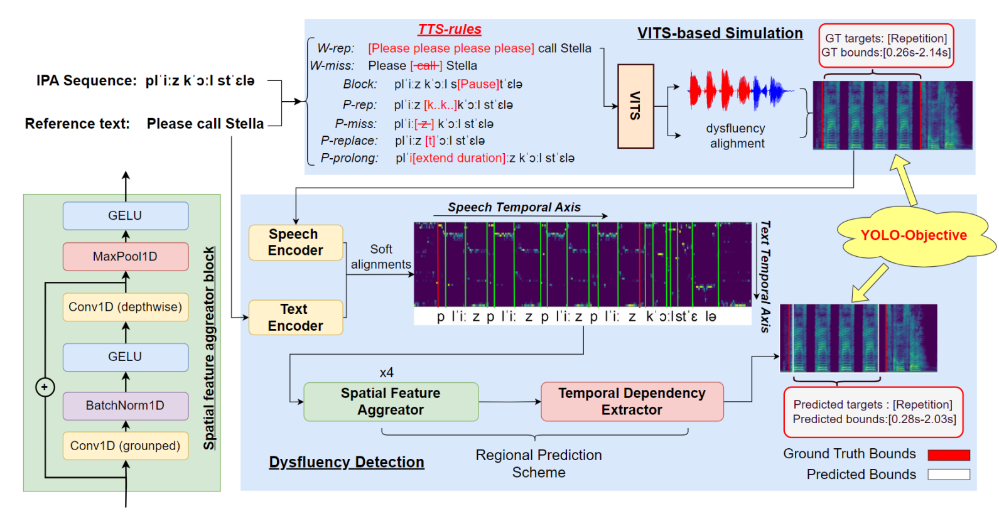

# YOLO-Stutter: End-to-end Region-Wise Speech Dysfluency Detection

## Workflow


## Environment configuration
Please refer [environment.yml](environment.yml)

If you have Miniconda/Anaconda installed, you can directly use the command: `conda env create -f environment.yml`


## Dysfluency simulation
We use [VITS](https://github.com/jaywalnut310/vits) as our TTS model.

0. Clone thies repository

0. Download [VITS pretrained models](https://drive.google.com/drive/folders/1ksarh-cJf3F5eKJjLVWY0X1j1qsQqiS2?usp=sharing), here we need `pretrained_vctk.pth` to achieve multi-speaker.
   1. create a folder `dysfluency_simulation/path/to`, and put the downloaded model into it.

0. Build Monotonoic Alignment Search
```sh
cd dysfluency_simulation/monotonic_align
python setup.py build_ext --inplace
```
3. Generate simulated speech
```sh
# Phoneme level
python generate_phn.py

# word level
python generate_word.py
```


## Datasets
The datasets will be open sourced soon.
